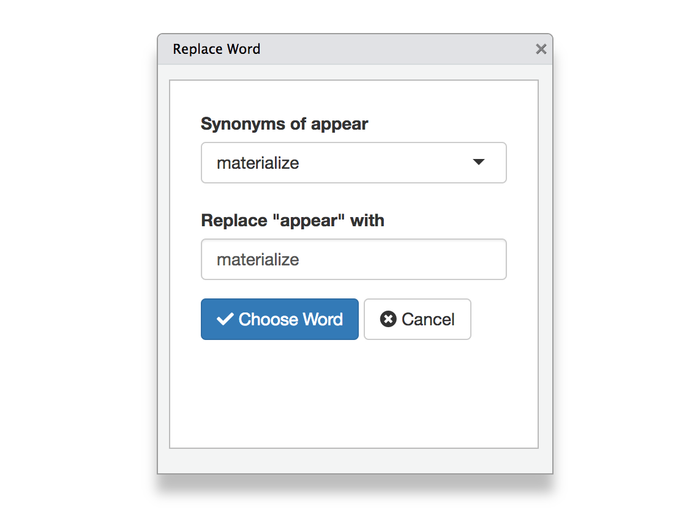

# synamyn 

**synamyn** is a simple RStudio addin based on [ropenscilabs/syn](https://github.com/ropenscilabs/syn) that lets you replace the selected word with a synonym or antonym.

## Installation

You can install the released version of synamyn from GitHub with:

``` r
# install.packages("remotes")
remotes::install_github("gadenbuie/synamyn")
```

To use it, simply select a _single_ word and choose one of the two addins

- Replace Word with Synonym

- Replace Word with Antonym

and a dialog will ~~appear~~ ~~open~~ ~~deploy~~ materialize.



Learn more about **syn** at <https://syn.njtierney.com/>.
